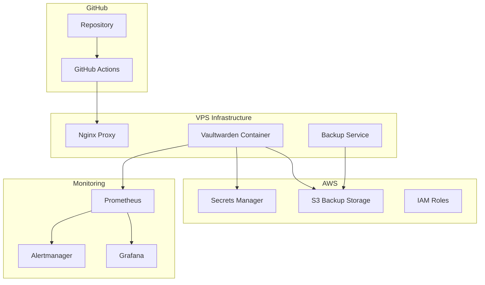

# 🔐 ValkyrieVault

<div align="center">


[](https://github.com/ton-username/vaultwarden-infra/actions/workflows/infrastructure.yml)
[](https://github.com/ton-username/vaultwarden-infra/actions/workflows/security.yml)
[](LICENSE)
[](docs/10-contributing.md)

**Production-ready, self-hosted Bitwarden alternative with enterprise-grade backup and monitoring**

[Quick Start](docs/01-quick-start.md) •
[Architecture](docs/02-architecture.md) •
[Installation](docs/03-installation.md) •
[Configuration](docs/04-configuration.md) •
[Operations](docs/07-operations.md)

</div>

---

## 🚀 Overview

This project provides a complete Infrastructure-as-Code solution for deploying and managing a production-ready Vaultwarden instance with:

- **🏗️ Multi-environment setup** (Development, Staging, Production)
- **☁️ AWS-based backup strategy** with automated retention policies
- **🔄 GitOps deployment** with GitHub Actions
- **🛡️ Enterprise security** with encryption and monitoring
- **📊 Comprehensive observability** and alerting
- **🔧 Automated operations** and disaster recovery

## ✨ Features

- **Infrastructure as Code** with OpenTofu/Terraform
- **Multi-tier backup strategy** (Hourly, Daily, Monthly, Yearly)
- **Zero-downtime deployments** with health checks
- **Automated SSL/TLS** with Let's Encrypt
- **Monitoring and alerting** with Prometheus/Grafana
- **Security scanning** and dependency updates
- **Disaster recovery** procedures and testing

## 📋 Prerequisites

- **AWS Account** with appropriate permissions
- **VPS/Server** (OVH, DigitalOcean, AWS EC2, etc.)
- **Domain name** with DNS control
- **GitHub account** for GitOps

## 🏃‍♂️ Quick Start

```bash
# 1. Clone the repository
git clone https://github.com/ton-username/vaultwarden-infra.git
cd vaultwarden-infra

# 2. Configure your environment
cp terraform/environments/production/terraform.tfvars.example terraform/environments/production/terraform.tfvars
# Edit the file with your values

# 3. Deploy infrastructure
./scripts/deploy.sh production

# 4. Access your Vaultwarden instance
open https://vault.yourdomain.com
```

## 📚 Documentation

| Section                                           | Description                                 |
| ------------------------------------------------- | ------------------------------------------- |
| [🚀 Quick Start](docs/01-quick-start.md)          | Get up and running in minutes               |
| [🏗️ Architecture](docs/02-architecture.md)        | System design and components                |
| [⚙️ Installation](docs/03-installation.md)        | Step-by-step installation guide             |
| [🔧 Configuration](docs/04-configuration.md)      | Configuration options and secrets           |
| [🚀 Deployment](docs/05-deployment.md)            | Deployment strategies and automation        |
| [👨‍💻 Development](docs/06-development-workflow.md) | Development workflow and contribution guide |
| [🔧 Operations](docs/07-operations.md)            | Day-to-day operations and maintenance       |
| [🐛 Troubleshooting](docs/08-troubleshooting.md)  | Common issues and solutions                 |
| [🔒 Security](docs/09-security.md)                | Security best practices and compliance      |
| [🤝 Contributing](docs/10-contributing.md)        | How to contribute to this project           |

## 🏛️ Architecture Overview



## 🌍 Multi-Environment Strategy

| Environment     | Branch    | Purpose                         | Backup Retention                           |
| --------------- | --------- | ------------------------------- | ------------------------------------------ |
| **Development** | `develop` | Feature development and testing | 24h hourly, 7 daily                        |
| **Staging**     | `staging` | Pre-production validation       | 48h hourly, 14 daily                       |
| **Production**  | `main`    | Live environment                | 48h hourly, 30 daily, 12 monthly, 5 yearly |

## 🤖 AI-Assisted Development

This project is **LLM-friendly** and designed to work seamlessly with AI development assistants.

### Quick AI Context Loading

```bash
# Load complete project context for your AI assistant
./scripts/ai-context.sh full

# Load specific context for your development task
./scripts/ai-context.sh terraform    # Infrastructure work
./scripts/ai-context.sh docker      # Container development
./scripts/ai-context.sh security    # Security implementation
./scripts/ai-context.sh deployment  # CI/CD and deployment
./scripts/ai-context.sh troubleshoot # Debugging assistance
```

### AI Development Workflow

1. **Load Context**: Use `./scripts/ai-context.sh <type> --copy` to copy context to clipboard
2. **Paste to AI**: Provide the context to your AI assistant (ChatGPT, Claude, etc.)
3. **Request Help**: Ask for code generation, review, or troubleshooting assistance
4. **Follow Standards**: AI responses follow our established coding standards and security practices

### Available AI Features

| Feature          | Command                                    | Description                    |
| ---------------- | ------------------------------------------ | ------------------------------ |
| **Full Context** | `./scripts/ai-context.sh full`             | Complete project understanding |
| **Quick Copy**   | `./scripts/ai-context.sh terraform --copy` | Copy context to clipboard      |
| **Save Context** | `./scripts/ai-context.sh docker --file`    | Save context to file           |
| **Stats**        | `./scripts/ai-context.sh security --stats` | View context statistics        |

### Example AI Workflow

```bash
# 1. Load Terraform context for infrastructure changes
./scripts/ai-context.sh terraform --copy

# 2. Paste context into your AI assistant and ask:
# "I need to add a new backup retention policy for development environment.
#  Please provide Terraform code following the project patterns."

# 3. AI will provide code that follows:
#   - Project naming conventions
#   - Security best practices
#   - Multi-environment patterns
#   - Proper resource tagging
```

See [**AI Development Guide**](docs/11-ai-development.md) for comprehensive AI assistance documentation.

## 🔐 Security Features

- **End-to-end encryption** with client-side encryption
- **Backup encryption** with GPG and rotating keys
- **Network security** with firewall rules and VPN support
- **Access controls** with IAM policies and least privilege
- **Audit logging** and security monitoring
- **Automated security updates** and vulnerability scanning

## 📊 Monitoring & Observability

- **Application metrics** (response time, error rates, user activity)
- **Infrastructure metrics** (CPU, memory, disk, network)
- **Backup monitoring** (success rates, data integrity)
- **Alerting** (email, Slack, PagerDuty integration)
- **Log aggregation** and analysis

## 🆘 Support

- **Documentation**: Check our comprehensive [docs](docs/)
- **Issues**: Report issues on [GitHub Issues](https://github.com/ton-username/vaultwarden-infra/issues)
- **Discussions**: Join discussions on [GitHub Discussions](https://github.com/ton-username/vaultwarden-infra/discussions)

## 📄 License

This project is licensed under the MIT License - see the [LICENSE](LICENSE) file for details.

## 🎯 Roadmap

- [ ] **Kubernetes support** with Helm charts
- [ ] **Multi-region deployment** for high availability
- [ ] **Advanced monitoring** with custom dashboards
- [ ] **Automated disaster recovery** testing
- [ ] **Integration tests** and end-to-end testing

## ⭐ Contributors

Thanks to all contributors who have helped with this project!

<a href="https://github.com/ton-username/vaultwarden-infra/graphs/contributors">
  
</a>

---

<div align="center">
  <sub>Built with ❤️ by <a href="https://github.com/ton-username">Your Name</a></sub>
</div>
