# 🏗️ Architecture Overview

This document provides a comprehensive overview of the ValkyrieVault architecture, including system design, component interactions, and deployment patterns.

## 🎯 Design Principles

### Core Principles

- **Security First**: End-to-end encryption, zero-trust architecture
- **Resilience**: Multi-tier backup strategy, disaster recovery
- **Scalability**: Horizontal scaling capabilities, performance optimization
- **Observability**: Comprehensive monitoring, logging, and alerting
- **Automation**: Infrastructure as Code, GitOps deployment

### Architecture Patterns

- **Infrastructure as Code**: All infrastructure defined in OpenTofu/Terraform
- **GitOps**: Deployments driven by Git commits and pull requests
- **Multi-Environment**: Separate environments for development, staging, production
- **Microservices**: Containerized application with separate backup service
- **Event-Driven**: Automated responses to system events and alerts

## 🏛️ System Architecture

### High-Level Architecture

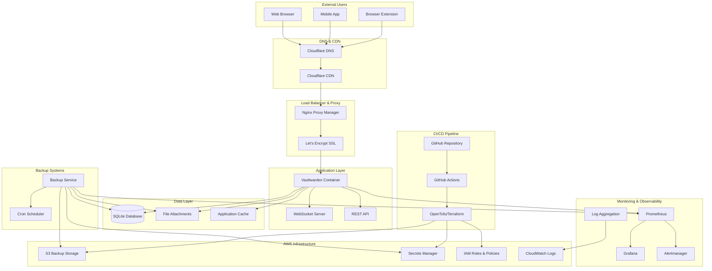

### Network Architecture

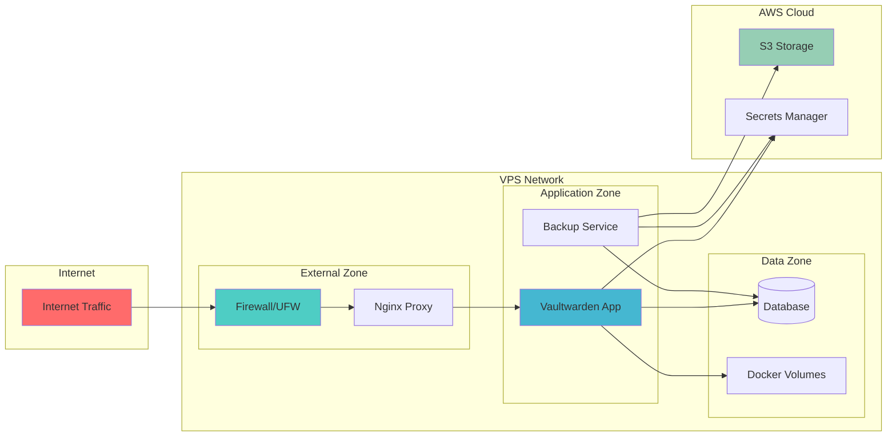

## 🔧 Component Deep Dive

### Vaultwarden Application

```yaml
# Core application specifications
Container: vaultwarden/server:latest
Resources:
  CPU: 0.5-1.0 cores
  Memory: 256-512MB
  Storage: 1-10GB (grows with users)

Network:
  Internal Port: 80 (HTTP)
  WebSocket Port: 3012
  External Port: 443 (HTTPS via proxy)

Environment Variables:
  - DOMAIN: https://vault.yourdomain.com
  - DATABASE_URL: sqlite:///data/db.sqlite3
  - ADMIN_TOKEN: <generated-secure-token>
  - WEBSOCKET_ENABLED: true
  - SENDS_ALLOWED: true
  - ORG_CREATION_USERS: all
```

### Backup Service Architecture

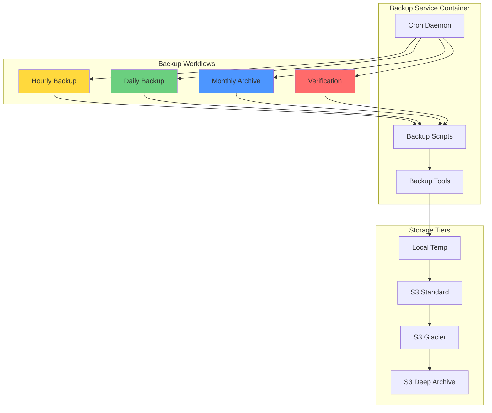

### Database Architecture

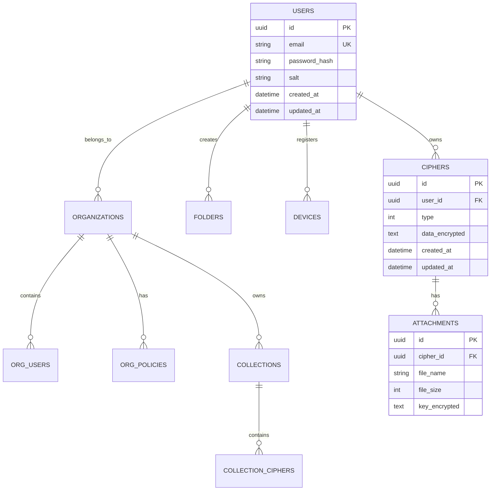

## 🌐 Multi-Environment Architecture

### Environment Segregation

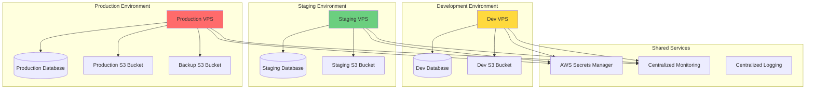

### Resource Allocation by Environment

| Component            | Development           | Staging                 | Production                          |
| -------------------- | --------------------- | ----------------------- | ----------------------------------- |
| **VPS Size**         | 1GB RAM, 1 CPU        | 2GB RAM, 1 CPU          | 4GB RAM, 2 CPU                      |
| **Storage**          | 10GB SSD              | 20GB SSD                | 50GB SSD                            |
| **Backup Retention** | 1 day hourly, 7 daily | 2 days hourly, 14 daily | 2 days hourly, 30 daily, 12 monthly |
| **Monitoring**       | Basic                 | Enhanced                | Full + Alerting                     |
| **SSL Certificate**  | Let's Encrypt         | Let's Encrypt           | Let's Encrypt + Monitoring          |

## 🔒 Security Architecture

### Defense in Depth

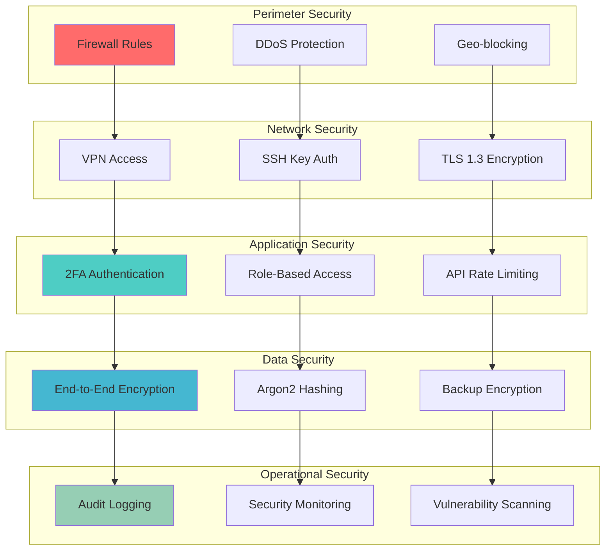

### Encryption Architecture

```mermaid
graph LR
    subgraph "Client Side"
        MASTER[Master Password]
        KEY[Master Key]
        ENC_KEY[Encryption Key]
    end

    subgraph "Transport"
        TLS[TLS 1.3]
        CERT[SSL Certificate]
    end

    subgraph "Server Side"
        HASH[Password Hash]
        SALT[Random Salt]
        CIPHER[Encrypted Ciphers]
    end

    subgraph "Backup Encryption"
        GPG[GPG Encryption]
        BACKUP_KEY[Backup Key]
        S3_ENC[S3 Encryption]
    end

    MASTER --> KEY
    KEY --> ENC_KEY
    ENC_KEY --> TLS
    TLS --> CERT

    CERT --> HASH
    HASH --> SALT
    SALT --> CIPHER

    CIPHER --> GPG
    GPG --> BACKUP_KEY
    BACKUP_KEY --> S3_ENC

    style MASTER fill:#ff6b6b
    style TLS fill:#4ecdc4
    style GPG fill:#45b7d1
```

## 📊 Data Flow Architecture

### User Registration & Authentication

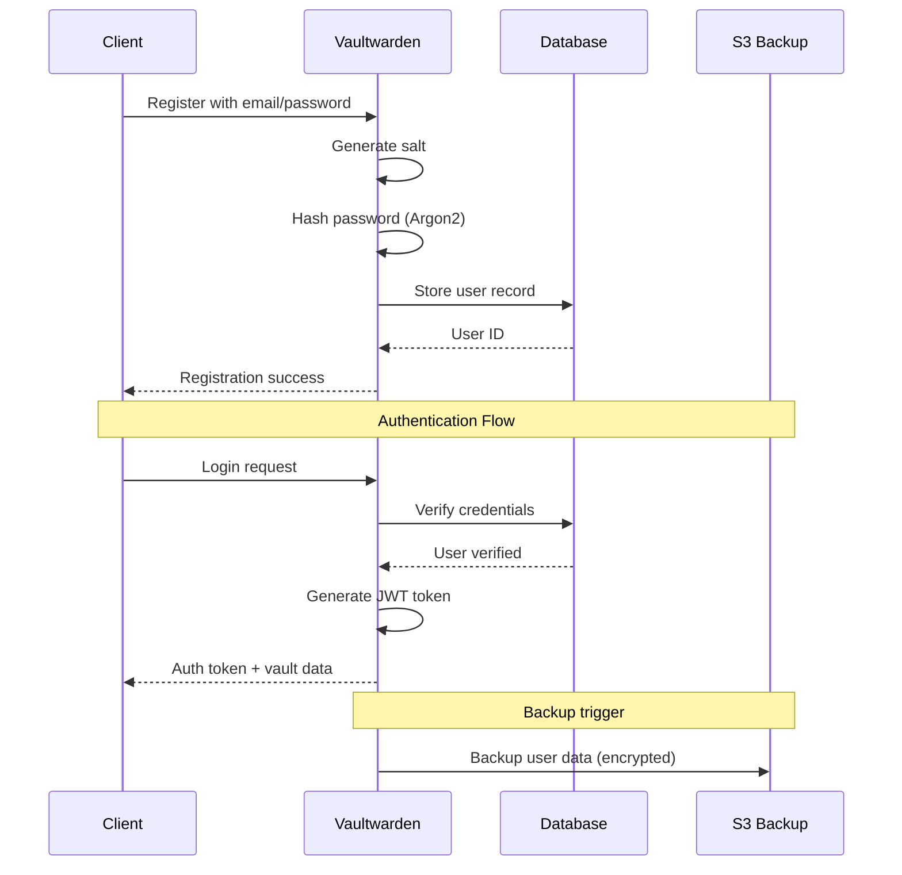

### Data Synchronization

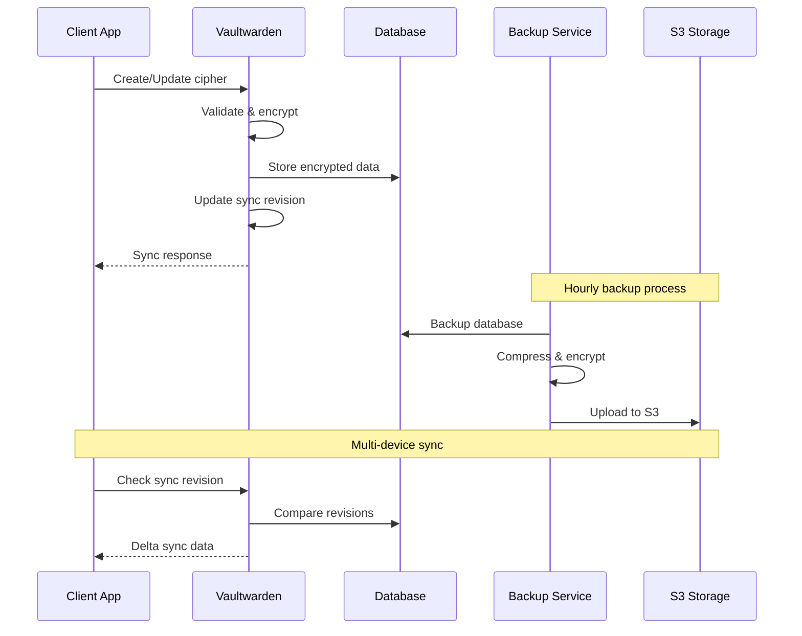

## 🚀 Deployment Architecture

### GitOps Workflow

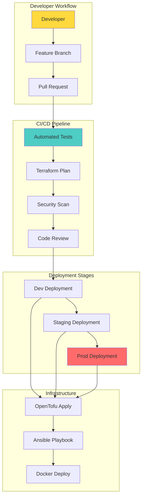

### Container Orchestration

```yaml
# Docker Compose Architecture
version: "3.8"

networks:
  vaultwarden_network:
    driver: bridge
    ipam:
      config:
        - subnet: 172.20.0.0/16

volumes:
  vw_data:
    driver: local
    driver_opts:
      type: none
      o: bind
      device: /opt/vaultwarden/data

services:
  nginx-proxy:
    image: nginxproxy/nginx-proxy:1.0
    networks:
      vaultwarden_network:
        ipv4_address: 172.20.0.10

  vaultwarden:
    image: vaultwarden/server:latest
    networks:
      vaultwarden_network:
        ipv4_address: 172.20.0.20
    depends_on:
      - nginx-proxy

  backup-service:
    image: alpine:latest
    networks:
      vaultwarden_network:
        ipv4_address: 172.20.0.30
    depends_on:
      - vaultwarden

  prometheus:
    image: prom/prometheus:latest
    networks:
      vaultwarden_network:
        ipv4_address: 172.20.0.40
```

## 📐 Scaling Considerations

### Vertical Scaling Limits

| Metric                  | Small Instance | Medium Instance | Large Instance |
| ----------------------- | -------------- | --------------- | -------------- |
| **Users**               | 1-50           | 50-200          | 200-1000       |
| **CPU**                 | 1 core         | 2 cores         | 4 cores        |
| **Memory**              | 1GB            | 2GB             | 4GB            |
| **Storage**             | 10GB           | 25GB            | 50GB           |
| **Concurrent Sessions** | 10             | 50              | 200            |

### Horizontal Scaling Options

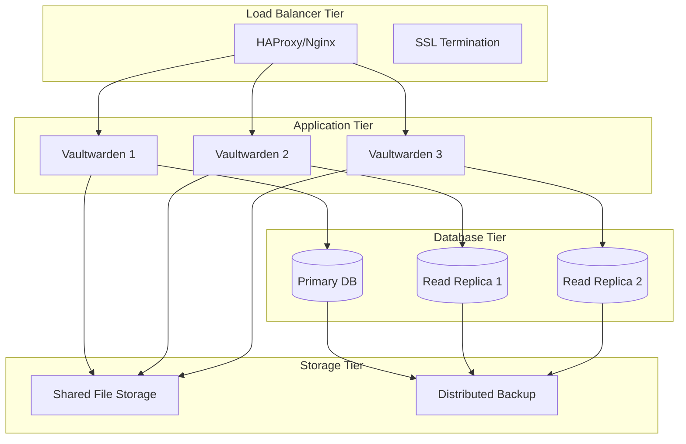

_Note: Vaultwarden currently doesn't support true horizontal scaling due to SQLite limitations. This diagram shows a potential future PostgreSQL-based architecture._

---

[← Quick Start](01-quick-start.md) | [Installation Guide →](03-installation.md)
