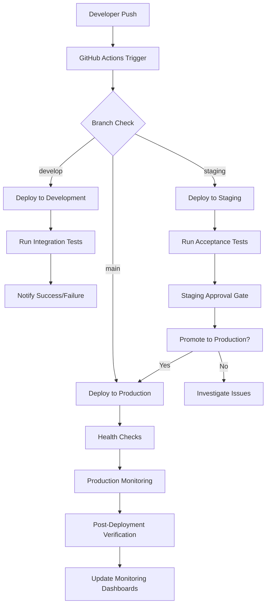

# 🚀 Deployment Guide

This document covers deployment strategies, automation, and best practices for deploying ValkyrieVault across different environments.

## 🎯 Deployment Strategies

### Overview of Deployment Approaches

| Strategy        | Use Case            | Complexity | Risk Level | Rollback Time |
| --------------- | ------------------- | ---------- | ---------- | ------------- |
| **Blue-Green**  | Production releases | Medium     | Low        | < 1 minute    |
| **Rolling**     | Regular updates     | Low        | Medium     | 2-5 minutes   |
| **Canary**      | High-risk changes   | High       | Low        | < 30 seconds  |
| **Recreate**    | Development/staging | Low        | High       | 2-10 minutes  |
| **A/B Testing** | Feature validation  | High       | Low        | Instant       |

### Recommended Strategy by Environment

- **Development**: Recreate deployment (fastest, downtime acceptable)
- **Staging**: Blue-Green deployment (production-like testing)
- **Production**: Blue-Green with canary testing (maximum safety)

## 🔄 Automated Deployment Pipeline

### GitOps Workflow Overview



### Deployment Pipeline Configuration

```yaml
# .github/workflows/deploy.yml
name: Deploy ValkyrieVault

on:
  push:
    branches: [main, staging, develop]
    paths:
      - "terraform/**"
      - "docker/**"
      - "ansible/**"
      - ".github/workflows/**"

  pull_request:
    branches: [main, staging]
    paths:
      - "terraform/**"
      - "docker/**"
      - "ansible/**"

  workflow_dispatch:
    inputs:
      environment:
        description: "Target environment"
        required: true
        default: "staging"
        type: choice
        options:
          - development
          - staging
          - production
      deployment_strategy:
        description: "Deployment strategy"
        required: true
        default: "blue-green"
        type: choice
        options:
          - blue-green
          - rolling
          - recreate
          - canary

env:
  TERRAFORM_VERSION: "1.6.0"
  ANSIBLE_VERSION: "2.15.0"
  AWS_REGION: "eu-west-3"

jobs:
  determine-environment:
    runs-on: ubuntu-latest
    outputs:
      environment: ${{ steps.env.outputs.environment }}
      strategy: ${{ steps.env.outputs.strategy }}
      matrix: ${{ steps.env.outputs.matrix }}

    steps:
      - name: Determine deployment parameters
        id: env
        run: |
          if [[ "${{ github.event_name }}" == "workflow_dispatch" ]]; then
            echo "environment=${{ github.event.inputs.environment }}" >> $GITHUB_OUTPUT
            echo "strategy=${{ github.event.inputs.deployment_strategy }}" >> $GITHUB_OUTPUT
          elif [[ "${{ github.ref }}" == "refs/heads/main" ]]; then
            echo "environment=production" >> $GITHUB_OUTPUT
            echo "strategy=blue-green" >> $GITHUB_OUTPUT
          elif [[ "${{ github.ref }}" == "refs/heads/staging" ]]; then
            echo "environment=staging" >> $GITHUB_OUTPUT
            echo "strategy=blue-green" >> $GITHUB_OUTPUT
          elif [[ "${{ github.ref }}" == "refs/heads/develop" ]]; then
            echo "environment=development" >> $GITHUB_OUTPUT
            echo "strategy=recreate" >> $GITHUB_OUTPUT
          fi

          # Create deployment matrix for parallel deployments
          echo 'matrix={"include":[{"env":"'${environment}'","strategy":"'${strategy}'"}]}' >> $GITHUB_OUTPUT

  security-scan:
    runs-on: ubuntu-latest
    steps:
      - uses: actions/checkout@v4

      - name: Run Trivy vulnerability scanner
        uses: aquasecurity/trivy-action@master
        with:
          scan-type: "fs"
          format: "sarif"
          output: "trivy-results.sarif"

      - name: Upload Trivy scan results
        uses: github/codeql-action/upload-sarif@v3
        with:
          sarif_file: "trivy-results.sarif"

      - name: Run Checkov static analysis
        run: |
          pip install checkov
          checkov -d terraform/ --framework terraform --output cli --output sarif --output-file-path checkov-results.sarif

      - name: Scan for secrets
        uses: gitleaks/gitleaks-action@v2

  infrastructure-plan:
    needs: [determine-environment, security-scan]
    runs-on: ubuntu-latest
    environment: ${{ needs.determine-environment.outputs.environment }}

    outputs:
      plan-exists: ${{ steps.plan.outputs.plan-exists }}
      plan-summary: ${{ steps.plan.outputs.plan-summary }}

    defaults:
      run:
        working-directory: terraform/environments/${{ needs.determine-environment.outputs.environment }}

    steps:
      - uses: actions/checkout@v4

      - name: Setup OpenTofu
        uses: opentofu/setup-opentofu@v1
        with:
          tofu_version: ${{ env.TERRAFORM_VERSION }}

      - name: Configure AWS credentials
        uses: aws-actions/configure-aws-credentials@v4
        with:
          aws-access-key-id: ${{ secrets.AWS_ACCESS_KEY_ID }}
          aws-secret-access-key: ${{ secrets.AWS_SECRET_ACCESS_KEY }}
          aws-region: ${{ env.AWS_REGION }}

      - name: Terraform Init
        run: |
          tofu init
          tofu workspace select ${{ needs.determine-environment.outputs.environment }} || tofu workspace new ${{ needs.determine-environment.outputs.environment }}

      - name: Terraform Validate
        run: tofu validate

      - name: Terraform Plan
        id: plan
        run: |
          set +e
          tofu plan -detailed-exitcode -out=tfplan 2>&1 | tee plan.log
          exit_code=$?

          if [[ $exit_code -eq 0 ]]; then
            echo "plan-exists=false" >> $GITHUB_OUTPUT
            echo "plan-summary=No changes detected" >> $GITHUB_OUTPUT
          elif [[ $exit_code -eq 2 ]]; then
            echo "plan-exists=true" >> $GITHUB_OUTPUT
            changes=$(grep -c "will be" plan.log || echo "0")
            echo "plan-summary=$changes resources will be modified" >> $GITHUB_OUTPUT
          else
            echo "❌ Terraform plan failed"
            cat plan.log
            exit 1
          fi

      - name: Upload Terraform Plan
        if: steps.plan.outputs.plan-exists == 'true'
        uses: actions/upload-artifact@v4
        with:
          name: tfplan-${{ needs.determine-environment.outputs.environment }}
          path: terraform/environments/${{ needs.determine-environment.outputs.environment }}/tfplan
          retention-days: 1

      - name: Comment PR with plan
        if: github.event_name == 'pull_request'
        uses: actions/github-script@v7
        with:
          script: |
            github.rest.issues.createComment({
              issue_number: context.issue.number,
              owner: context.repo.owner,
              repo: context.repo.repo,
              body: `## Terraform Plan Results for ${{ needs.determine-environment.outputs.environment }}
              
              **Plan Summary**: ${{ steps.plan.outputs.plan-summary }}
              **Changes Detected**: ${{ steps.plan.outputs.plan-exists }}
              
              <details><summary>Show Plan Details</summary>
              
              \`\`\`
              $(cat terraform/environments/${{ needs.determine-environment.outputs.environment }}/plan.log)
              \`\`\`
              
              </details>`
            })

  infrastructure-deploy:
    needs: [determine-environment, infrastructure-plan]
    if: |
      needs.infrastructure-plan.outputs.plan-exists == 'true' &&
      (github.event_name == 'push' || github.event_name == 'workflow_dispatch') &&
      github.ref != 'refs/heads/main' || 
      (github.ref == 'refs/heads/main' && github.event_name == 'workflow_dispatch')

    runs-on: ubuntu-latest
    environment: ${{ needs.determine-environment.outputs.environment }}

    defaults:
      run:
        working-directory: terraform/environments/${{ needs.determine-environment.outputs.environment }}

    outputs:
      vpc-id: ${{ steps.outputs.outputs.vpc-id }}
      s3-bucket: ${{ steps.outputs.outputs.s3-bucket }}
      secrets-arn: ${{ steps.outputs.outputs.secrets-arn }}

    steps:
      - uses: actions/checkout@v4

      - name: Setup OpenTofu
        uses: opentofu/setup-opentofu@v1
        with:
          tofu_version: ${{ env.TERRAFORM_VERSION }}

      - name: Configure AWS credentials
        uses: aws-actions/configure-aws-credentials@v4
        with:
          aws-access-key-id: ${{ secrets.AWS_ACCESS_KEY_ID }}
          aws-secret-access-key: ${{ secrets.AWS_SECRET_ACCESS_KEY }}
          aws-region: ${{ env.AWS_REGION }}

      - name: Download Terraform Plan
        uses: actions/download-artifact@v4
        with:
          name: tfplan-${{ needs.determine-environment.outputs.environment }}
          path: terraform/environments/${{ needs.determine-environment.outputs.environment }}

      - name: Terraform Init
        run: |
          tofu init
          tofu workspace select ${{ needs.determine-environment.outputs.environment }}

      - name: Terraform Apply
        run: |
          tofu apply tfplan
          echo "✅ Infrastructure deployment completed"

      - name: Extract Terraform Outputs
        id: outputs
        run: |
          echo "vpc-id=$(tofu output -raw vpc_id 2>/dev/null || echo '')" >> $GITHUB_OUTPUT
          echo "s3-bucket=$(tofu output -raw s3_bucket_name)" >> $GITHUB_OUTPUT
          echo "secrets-arn=$(tofu output -raw secrets_manager_arn)" >> $GITHUB_OUTPUT

      - name: Update deployment status
        run: |
          echo "Infrastructure deployed successfully to ${{ needs.determine-environment.outputs.environment }}"
          echo "S3 Bucket: ${{ steps.outputs.outputs.s3-bucket }}"

  application-deploy:
    needs: [determine-environment, infrastructure-deploy]
    if: always() && (needs.infrastructure-deploy.result == 'success' || needs.infrastructure-deploy.result == 'skipped')

    runs-on: ubuntu-latest
    environment: ${{ needs.determine-environment.outputs.environment }}

    strategy:
      matrix:
        include:
          - deployment_type: ${{ needs.determine-environment.outputs.strategy }}

    steps:
      - uses: actions/checkout@v4

      - name: Setup deployment variables
        id: vars
        run: |
          case "${{ needs.determine-environment.outputs.environment }}" in
            "production")
              echo "vps_host=${{ secrets.VPS_HOST_PROD }}" >> $GITHUB_OUTPUT
              echo "domain=${{ secrets.DOMAIN_PROD }}" >> $GITHUB_OUTPUT
              echo "compose_file=docker-compose.prod.yml" >> $GITHUB_OUTPUT
              ;;
            "staging")
              echo "vps_host=${{ secrets.VPS_HOST_STAGING }}" >> $GITHUB_OUTPUT
              echo "domain=${{ secrets.DOMAIN_STAGING }}" >> $GITHUB_OUTPUT
              echo "compose_file=docker-compose.staging.yml" >> $GITHUB_OUTPUT
              ;;
            "development")
              echo "vps_host=${{ secrets.VPS_HOST_DEV }}" >> $GITHUB_OUTPUT
              echo "domain=${{ secrets.DOMAIN_DEV }}" >> $GITHUB_OUTPUT
              echo "compose_file=docker-compose.dev.yml" >> $GITHUB_OUTPUT
              ;;
          esac

      - name: Deploy with ${{ matrix.deployment_type }} strategy
        uses: appleboy/ssh-action@v0.1.7
        with:
          host: ${{ steps.vars.outputs.vps_host }}
          username: ${{ secrets.VPS_USER }}
          key: ${{ secrets.VPS_SSH_KEY }}
          script: |
            set -e

            ENV="${{ needs.determine-environment.outputs.environment }}"
            STRATEGY="${{ matrix.deployment_type }}"
            DEPLOYMENT_ID="$(date +%Y%m%d-%H%M%S)-$(echo $GITHUB_SHA | cut -c1-8)"

            echo "🚀 Starting deployment: $ENV with $STRATEGY strategy"
            echo "Deployment ID: $DEPLOYMENT_ID"

            # Setup deployment directory
            DEPLOY_DIR="/opt/vaultwarden-${ENV}"
            mkdir -p "$DEPLOY_DIR"
            cd "$DEPLOY_DIR"

            # Backup current deployment
            if [[ -f "docker-compose.yml" && "$STRATEGY" != "recreate" ]]; then
              echo "📦 Creating deployment backup"
              mkdir -p "backups/$DEPLOYMENT_ID"
              cp -r docker-compose.yml .env backups/$DEPLOYMENT_ID/ || true
            fi

            # Clone or update repository
            if [[ ! -d ".git" ]]; then
              git clone -b ${{ github.ref_name }} ${{ github.server_url }}/${{ github.repository }} .
            else
              git fetch origin
              git checkout ${{ github.ref_name }}
              git pull origin ${{ github.ref_name }}
            fi

            # Configure environment
            export AWS_DEFAULT_REGION=${{ env.AWS_REGION }}

            echo "⚙️ Retrieving configuration from AWS Secrets Manager"
            aws secretsmanager get-secret-value \
              --secret-id "vaultwarden-${ENV}-config" \
              --query SecretString --output text > .env.tmp

            # Generate environment file
            python3 -c "
            import json, os
            secrets = json.loads(open('.env.tmp').read())
            with open('.env', 'w') as f:
                f.write('# Generated on $(date)\n')
                f.write('ENVIRONMENT=${ENV}\n')
                f.write('DOMAIN=${{ steps.vars.outputs.domain }}\n')
                f.write('DEPLOYMENT_ID=${DEPLOYMENT_ID}\n')
                for k, v in secrets.items():
                    f.write(f'{k.upper()}={v}\n')
            "
            rm -f .env.tmp

            echo "🐳 Executing $STRATEGY deployment"
            case "$STRATEGY" in
              "blue-green")
                ./scripts/deploy-blue-green.sh "${{ steps.vars.outputs.compose_file }}"
                ;;
              "rolling")
                ./scripts/deploy-rolling.sh "${{ steps.vars.outputs.compose_file }}"
                ;;
              "canary")
                ./scripts/deploy-canary.sh "${{ steps.vars.outputs.compose_file }}"
                ;;
              "recreate"|*)
                ./scripts/deploy-recreate.sh "${{ steps.vars.outputs.compose_file }}"
                ;;
            esac

            echo "✅ Deployment completed successfully"

      - name: Post-deployment health checks
        run: |
          sleep 30

          # Health check endpoint
          for i in {1..10}; do
            if curl -f --max-time 10 "${{ steps.vars.outputs.domain }}/alive"; then
              echo "✅ Health check passed"
              break
            else
              echo "⏳ Health check attempt $i/10 failed, retrying..."
              sleep 10
            fi
          done

          # Extended health verification
          curl -f "${{ steps.vars.outputs.domain }}/api/config" > /dev/null
          echo "✅ API configuration endpoint accessible"

      - name: Update deployment status
        if: always()
        uses: actions/github-script@v7
        with:
          script: |
            const status = '${{ job.status }}' === 'success' ? 'success' : 'failure';
            const environment = '${{ needs.determine-environment.outputs.environment }}';
            const strategy = '${{ matrix.deployment_type }}';

            github.rest.repos.createDeploymentStatus({
              owner: context.repo.owner,
              repo: context.repo.repo,
              deployment_id: context.payload.deployment?.id,
              state: status,
              description: `Deployment ${status} using ${strategy} strategy`,
              environment_url: '${{ steps.vars.outputs.domain }}'
            });

  post-deployment-tests:
    needs: [determine-environment, application-deploy]
    if: needs.application-deploy.result == 'success'

    runs-on: ubuntu-latest
    steps:
      - uses: actions/checkout@v4

      - name: Setup test environment
        run: |
          case "${{ needs.determine-environment.outputs.environment }}" in
            "production")
              echo "TARGET_URL=${{ secrets.DOMAIN_PROD }}" >> $GITHUB_ENV
              ;;
            "staging")
              echo "TARGET_URL=${{ secrets.DOMAIN_STAGING }}" >> $GITHUB_ENV
              ;;
            "development")
              echo "TARGET_URL=${{ secrets.DOMAIN_DEV }}" >> $GITHUB_ENV
              ;;
          esac

      - name: Run integration tests
        run: |
          echo "🧪 Running post-deployment tests against $TARGET_URL"

          # Basic connectivity tests
          curl -f --max-time 30 "$TARGET_URL/alive"
          curl -f --max-time 30 "$TARGET_URL/api/config"

          # Performance baseline test
          response_time=$(curl -w "%{time_total}" -s -o /dev/null "$TARGET_URL")
          if (( $(echo "$response_time > 5.0" | bc -l) )); then
            echo "⚠️ Warning: Response time ${response_time}s exceeds 5s threshold"
          else
            echo "✅ Response time: ${response_time}s"
          fi

          # SSL certificate check
          if [[ "$TARGET_URL" == https://* ]]; then
            echo | openssl s_client -connect $(echo $TARGET_URL | sed 's|https://||'):443 -servername $(echo $TARGET_URL | sed 's|https://||') 2>/dev/null | openssl x509 -noout -dates
          fi

      - name: Performance testing
        if: needs.determine-environment.outputs.environment != 'development'
        run: |
          # Install k6 for load testing
          sudo gpg --no-default-keyring --keyring /usr/share/keyrings/k6-archive-keyring.gpg --keyserver hkp://keyserver.ubuntu.com:80 --recv-keys C5AD17C747E3415A3642D57D77C6C491D6AC1D69
          echo "deb [signed-by=/usr/share/keyrings/k6-archive-keyring.gpg] https://dl.k6.io/deb stable main" | sudo tee /etc/apt/sources.list.d/k6.list
          sudo apt-get update
          sudo apt-get install k6

          # Run performance test
          k6 run --duration 2m --vus 10 tests/k6/basic-load-test.js

  rollback:
    needs: [determine-environment, application-deploy, post-deployment-tests]
    if: failure() && needs.determine-environment.outputs.environment == 'production'

    runs-on: ubuntu-latest
    environment: production-emergency

    steps:
      - name: Emergency rollback
        uses: appleboy/ssh-action@v0.1.7
        with:
          host: ${{ secrets.VPS_HOST_PROD }}
          username: ${{ secrets.VPS_USER }}
          key: ${{ secrets.VPS_SSH_KEY }}
          script: |
            echo "🚨 Initiating emergency rollback"
            cd /opt/vaultwarden-prod

            # Find latest backup
            LATEST_BACKUP=$(ls -t backups/ | head -n 1)

            if [[ -n "$LATEST_BACKUP" ]]; then
              echo "📦 Rolling back to: $LATEST_BACKUP"
              
              # Stop current deployment
              docker-compose down
              
              # Restore backup
              cp "backups/$LATEST_BACKUP/docker-compose.yml" .
              cp "backups/$LATEST_BACKUP/.env" .
              
              # Start previous version
              docker-compose up -d
              
              echo "✅ Rollback completed"
            else
              echo "❌ No backup found for rollback"
              exit 1
            fi

      - name: Verify rollback
        run: |
          sleep 30
          curl -f --max-time 30 "${{ secrets.DOMAIN_PROD }}/alive"
          echo "✅ Rollback verification successful"

      - name: Notify rollback
        uses: actions/github-script@v7
        with:
          script: |
            github.rest.issues.create({
              owner: context.repo.owner,
              repo: context.repo.repo,
              title: `🚨 Emergency Rollback Executed - ${new Date().toISOString()}`,
              body: `## Emergency Rollback Report
              
              **Environment**: Production
              **Trigger**: Deployment failure
              **Rollback Time**: ${new Date().toISOString()}
              **Commit**: ${context.sha}
              
              ### Next Steps
              - [ ] Investigate deployment failure
              - [ ] Fix issues in staging environment
              - [ ] Plan re-deployment strategy
              
              ### Logs
              - [Failed Deployment](${context.payload.repository.html_url}/actions/runs/${context.runId})
              `,
              labels: ['emergency', 'rollback', 'production']
            });

  notification:
    needs: [determine-environment, application-deploy, post-deployment-tests]
    if: always()

    runs-on: ubuntu-latest
    steps:
      - name: Notify deployment status
        uses: actions/github-script@v7
        with:
          script: |
            const { owner, repo } = context.repo;
            const environment = '${{ needs.determine-environment.outputs.environment }}';
            const status = '${{ needs.application-deploy.result }}' === 'success' && '${{ needs.post-deployment-tests.result }}' !== 'failure' ? 'success' : 'failure';

            const emoji = status === 'success' ? '✅' : '❌';
            const title = `${emoji} Deployment ${status} - ${environment}`;

            github.rest.issues.createComment({
              issue_number: context.issue?.number || 0,
              owner,
              repo,
              body: `## ${title}
              
              **Environment**: ${environment}
              **Commit**: ${context.sha}
              **Deployment Time**: ${new Date().toISOString()}
              **Strategy**: ${{ needs.determine-environment.outputs.strategy }}
              
              ### Results
              - Infrastructure: ${{ needs.infrastructure-deploy.result || 'skipped' }}
              - Application: ${{ needs.application-deploy.result }}
              - Tests: ${{ needs.post-deployment-tests.result }}
              
              [View Deployment Run](${context.payload.repository.html_url}/actions/runs/${context.runId})`
            }).catch(err => console.log('Comment not posted:', err.message));
```

## 🎛️ Deployment Strategies Implementation

### Blue-Green Deployment

```bash
#!/bin/bash
# scripts/deploy-blue-green.sh

set -euo pipefail

COMPOSE_FILE=${1:-docker-compose.yml}
CURRENT_COLOR=$(docker-compose ps -q | wc -l > 0 && echo "blue" || echo "green")
NEW_COLOR=$([ "$CURRENT_COLOR" = "blue" ] && echo "green" || echo "blue")

echo "🔄 Blue-Green Deployment: $CURRENT_COLOR -> $NEW_COLOR"

# Start new environment
echo "🚀 Starting $NEW_COLOR environment"
docker-compose -f "$COMPOSE_FILE" -p "vw-$NEW_COLOR" up -d

# Wait for health check
echo "⏳ Waiting for $NEW_COLOR environment to be healthy"
for i in {1..30}; do
    if docker exec "vw-${NEW_COLOR}_vaultwarden_1" curl -f http://localhost:80/alive 2>/dev/null; then
        echo "✅ $NEW_COLOR environment is healthy"
        break
    fi
    sleep 10
done

# Switch traffic
echo "🔀 Switching traffic to $NEW_COLOR"
# Update nginx configuration or load balancer
docker exec nginx-proxy nginx -s reload

# Wait for traffic drain
echo "⏳ Waiting for traffic to drain from $CURRENT_COLOR"
sleep 30

# Stop old environment
echo "🛑 Stopping $CURRENT_COLOR environment"
docker-compose -f "$COMPOSE_FILE" -p "vw-$CURRENT_COLOR" down

echo "✅ Blue-Green deployment completed"
```

### Rolling Deployment

```bash
#!/bin/bash
# scripts/deploy-rolling.sh

set -euo pipefail

COMPOSE_FILE=${1:-docker-compose.yml}

echo "🔄 Rolling Deployment Started"

# Update images
echo "📥 Pulling latest images"
docker-compose -f "$COMPOSE_FILE" pull

# Rolling restart with health checks
services=$(docker-compose -f "$COMPOSE_FILE" config --services)

for service in $services; do
    echo "🔄 Rolling restart for service: $service"

    # Scale up with new version
    docker-compose -f "$COMPOSE_FILE" up -d --scale "$service"=2 "$service"

    # Wait for new instance to be healthy
    sleep 30

    # Health check
    if docker-compose -f "$COMPOSE_FILE" exec -T "$service" curl -f http://localhost:80/alive; then
        echo "✅ New $service instance is healthy"

        # Scale down old instance
        docker-compose -f "$COMPOSE_FILE" up -d --scale "$service"=1 "$service"
    else
        echo "❌ New $service instance failed health check"
        docker-compose -f "$COMPOSE_FILE" up -d --scale "$service"=1 "$service"
        exit 1
    fi
done

echo "✅ Rolling deployment completed"
```

### Canary Deployment

```bash
#!/bin/bash
# scripts/deploy-canary.sh

set -euo pipefail

COMPOSE_FILE=${1:-docker-compose.yml}
CANARY_PERCENT=${2:-10}

echo "🐤 Canary Deployment Started (${CANARY_PERCENT}% traffic)"

# Start canary instance
echo "🚀 Starting canary instance"
docker-compose -f "$COMPOSE_FILE" -p "vw-canary" up -d

# Configure traffic splitting (nginx upstream)
cat > /tmp/upstream.conf << EOF
upstream vaultwarden_backend {
    server vw-prod_vaultwarden_1:80 weight=$((100 - CANARY_PERCENT));
    server vw-canary_vaultwarden_1:80 weight=${CANARY_PERCENT};
}
EOF

docker cp /tmp/upstream.conf nginx-proxy:/etc/nginx/conf.d/upstream.conf
docker exec nginx-proxy nginx -s reload

echo "🔍 Canary running with ${CANARY_PERCENT}% traffic"
echo "Monitor metrics and run: ./scripts/canary-promote.sh or ./scripts/canary-rollback.sh"
```

### Recreate Deployment

```bash
#!/bin/bash
# scripts/deploy-recreate.sh

set -euo pipefail

COMPOSE_FILE=${1:-docker-compose.yml}

echo "🔄 Recreate Deployment Started"

# Stop all services
echo "🛑 Stopping all services"
docker-compose -f "$COMPOSE_FILE" down

# Pull latest images
echo "📥 Pulling latest images"
docker-compose -f "$COMPOSE_FILE" pull

# Start services
echo "🚀 Starting services with new images"
docker-compose -f "$COMPOSE_FILE" up -d

# Wait for services
echo "⏳ Waiting for services to be ready"
sleep 30

# Health check
if docker-compose -f "$COMPOSE_FILE" exec -T vaultwarden curl -f http://localhost:80/alive; then
    echo "✅ Recreate deployment completed successfully"
else
    echo "❌ Deployment health check failed"
    exit 1
fi
```

## 🧪 Testing in Deployment Pipeline

### Load Testing with K6

```javascript
// tests/k6/basic-load-test.js
import http from "k6/http";
import { check, sleep } from "k6";

export let options = {
  stages: [
    { duration: "30s", target: 5 }, // Ramp up
    { duration: "1m", target: 10 }, // Stay at 10 users
    { duration: "30s", target: 0 }, // Ramp down
  ],
  thresholds: {
    http_req_duration: ["p(95)<2000"], // 95% of requests under 2s
    http_req_failed: ["rate<0.1"], // Error rate under 10%
  },
};

export default function () {
  let response = http.get(`${__ENV.TARGET_URL}/alive`);

  check(response, {
    "status is 200": (r) => r.status === 200,
    "response time < 2s": (r) => r.timings.duration < 2000,
  });

  sleep(1);
}
```

### Integration Tests

```bash
#!/bin/bash
# tests/integration/api-tests.sh

set -euo pipefail

BASE_URL=${1:-https://vault.yourdomain.com}

echo "🧪 Running API integration tests against $BASE_URL"

# Test 1: Health endpoint
echo "Test 1: Health endpoint"
response=$(curl -s -w "%{http_code}" "$BASE_URL/alive")
if [[ "$response" == *"200" ]]; then
    echo "✅ Health endpoint responsive"
else
    echo "❌ Health endpoint failed: $response"
    exit 1
fi

# Test 2: Configuration endpoint
echo "Test 2: Configuration endpoint"
config_response=$(curl -s "$BASE_URL/api/config")
if echo "$config_response" | jq -e '.version' > /dev/null; then
    echo "✅ Configuration endpoint returns valid JSON"
else
    echo "❌ Configuration endpoint failed"
    exit 1
fi

# Test 3: User registration (if enabled)
echo "Test 3: User registration capability"
registration_allowed=$(echo "$config_response" | jq -r '.signups_allowed // false')
echo "Registration allowed: $registration_allowed"

# Test 4: WebSocket connection
echo "Test 4: WebSocket connectivity"
if command -v websocat > /dev/null; then
    timeout 10s websocat "wss://$(echo $BASE_URL | sed 's|https://||')/notifications/hub" -E <<< "" && echo "✅ WebSocket connection successful" || echo "⚠️ WebSocket test inconclusive"
fi

echo "🎉 Integration tests completed"
```

## 📊 Deployment Monitoring

### Deployment Metrics Collection

```bash
#!/bin/bash
# scripts/collect-deployment-metrics.sh

ENVIRONMENT=${1:-production}
DEPLOYMENT_ID=${2:-$(date +%Y%m%d-%H%M%S)}

echo "📊 Collecting deployment metrics for $ENVIRONMENT"

# Create metrics file
METRICS_FILE="/tmp/deployment-metrics-${DEPLOYMENT_ID}.json"

cat > "$METRICS_FILE" << EOF
{
  "deployment_id": "$DEPLOYMENT_ID",
  "environment": "$ENVIRONMENT",
  "timestamp": "$(date -u +%Y-%m-%dT%H:%M:%SZ)",
  "metrics": {
EOF

# Collect Docker metrics
echo "    \"containers\": {" >> "$METRICS_FILE"
docker stats --no-stream --format "table {{.Container}}\t{{.CPUPerc}}\t{{.MemUsage}}" | tail -n +2 | while read line; do
    container=$(echo $line | awk '{print $1}')
    cpu=$(echo $line | awk '{print $2}' | sed 's/%//')
    mem=$(echo $line | awk '{print $3}')

    echo "      \"$container\": {" >> "$METRICS_FILE"
    echo "        \"cpu_percent\": $cpu," >> "$METRICS_FILE"
    echo "        \"memory_usage\": \"$mem\"" >> "$METRICS_FILE"
    echo "      }," >> "$METRICS_FILE"
done

# Remove trailing comma and close
sed -i '$ s/,$//' "$METRICS_FILE"
echo "    }," >> "$METRICS_FILE"

# System metrics
echo "    \"system\": {" >> "$METRICS_FILE"
echo "      \"load_average\": \"$(uptime | awk -F'load average:' '{print $2}' | xargs)\"," >> "$METRICS_FILE"
echo "      \"disk_usage\": \"$(df -h / | tail -1 | awk '{print $5}')\"," >> "$METRICS_FILE"
echo "      \"memory_usage\": \"$(free | grep Mem | awk '{printf \"%.1f%%\", ($3/$2)*100}')\"" >> "$METRICS_FILE"
echo "    }" >> "$METRICS_FILE"

# Close JSON
echo "  }" >> "$METRICS_FILE"
echo "}" >> "$METRICS_FILE"

# Upload to S3 for analysis
aws s3 cp "$METRICS_FILE" "s3://vaultwarden-${ENVIRONMENT}-backups/metrics/"

echo "📊 Metrics collected and uploaded"
```

## 🚨 Deployment Rollback Procedures

### Automated Rollback

```bash
#!/bin/bash
# scripts/auto-rollback.sh

set -euo pipefail

ENVIRONMENT=${1:-production}
HEALTH_ENDPOINT=${2:-https://vault.yourdomain.com/alive}

echo "🔍 Monitoring deployment health for auto-rollback"

# Monitor for 5 minutes
for i in {1..30}; do
    if curl -f --max-time 10 "$HEALTH_ENDPOINT" > /dev/null 2>&1; then
        echo "✅ Health check $i/30 passed"
        sleep 10
    else
        echo "❌ Health check $i/30 failed"

        if [[ $i -ge 3 ]]; then
            echo "🚨 Triggering automatic rollback after 3 failed health checks"
            ./scripts/rollback.sh "$ENVIRONMENT"
            exit 1
        fi

        sleep 10
    fi
done

echo "✅ Deployment monitoring completed - no rollback needed"
```

### Manual Rollback

```bash
#!/bin/bash
# scripts/rollback.sh

set -euo pipefail

ENVIRONMENT=${1:-production}
TARGET_VERSION=${2:-previous}

echo "🔄 Initiating rollback for $ENVIRONMENT to $TARGET_VERSION"

cd "/opt/vaultwarden-$ENVIRONMENT"

case "$TARGET_VERSION" in
    "previous")
        BACKUP_DIR=$(ls -t backups/ | head -n 1)
        ;;
    *)
        BACKUP_DIR="$TARGET_VERSION"
        ;;
esac

if [[ ! -d "backups/$BACKUP_DIR" ]]; then
    echo "❌ Backup directory not found: $BACKUP_DIR"
    exit 1
fi

echo "📦 Rolling back to: $BACKUP_DIR"

# Stop current deployment
docker-compose down

# Restore backup
cp "backups/$BACKUP_DIR/"* .

# Start previous version
docker-compose up -d

# Wait for startup
sleep 30

# Verify rollback
if curl -f --max-time 30 "https://vault.yourdomain.com/alive"; then
    echo "✅ Rollback completed successfully"
else
    echo "❌ Rollback verification failed"
    exit 1
fi
```

---

[← Configuration](04-configuration.md) | [Troubleshooting →](08-troubleshooting.md)
