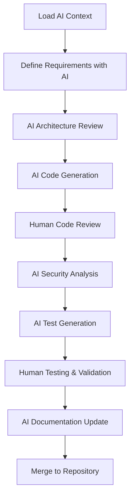

# 🤖 AI-Assisted Development Guide

This document provides guidelines and tools for using AI assistance effectively in the ValkyrieVault project.

## 🎯 Overview

This project is designed to be **LLM-friendly**, enabling developers to leverage AI assistance for:

- Code generation and review
- Infrastructure planning and optimization
- Documentation improvement
- Troubleshooting and debugging
- Security analysis and hardening

## 🧠 AI Context System

### Master AI Prompt

Use this comprehensive prompt to provide full context to any LLM when working on this project:

```markdown
[Copy the content from .ai/context-prompt.md below]
```

### Quick Context Files

For specific tasks, use these focused context files:

| File                             | Purpose                        | Use Case                        |
| -------------------------------- | ------------------------------ | ------------------------------- |
| `.ai/terraform-context.md`       | Terraform/OpenTofu development | Infrastructure changes          |
| `.ai/docker-context.md`          | Container configuration        | Docker/compose modifications    |
| `.ai/security-context.md`        | Security implementations       | Security features and hardening |
| `.ai/deployment-context.md`      | Deployment automation          | CI/CD and deployment scripts    |
| `.ai/troubleshooting-context.md` | Problem diagnosis              | Debugging and issue resolution  |

## 🛠️ AI Development Workflow

### 1. Starting a New Task

```bash
# Load project context for your AI assistant
cat .ai/context-prompt.md

# For specific domains, add focused context
cat .ai/terraform-context.md  # For infrastructure work
cat .ai/docker-context.md     # For container work
cat .ai/security-context.md   # For security work
```

### 2. AI-Assisted Code Review

```bash
# Generate AI review checklist
./scripts/ai-code-review.sh your-branch-name

# AI security analysis
./scripts/ai-security-check.sh
```

### 3. Documentation Generation

```bash
# AI-assisted documentation updates
./scripts/ai-docs-update.sh module-name

# Generate README updates
./scripts/ai-readme-sync.sh
```

## 📋 AI Assistance Best Practices

### Do's ✅

- **Always provide full project context** via the master prompt
- **Specify exact versions** of tools and technologies in use
- **Include relevant configuration files** in your AI conversations
- **Request code that follows project conventions** (S.O.L.I.D, Clean Code)
- **Ask for security-first implementations**
- **Request comprehensive error handling**

### Don'ts ❌

- **Don't assume AI knows project specifics** without context
- **Don't accept generic solutions** - request project-tailored code
- **Don't skip security considerations** in AI-generated code
- **Don't bypass established workflows** even with AI assistance
- **Don't commit AI code without review** and testing

### AI Prompt Templates

#### For Infrastructure Changes

```
Given the ValkyrieVault project context above, I need to [specific task].

Requirements:
- Use OpenTofu 1.6.0 syntax
- Follow our S3 backup strategy pattern
- Include appropriate tags and naming conventions
- Ensure security best practices
- Support multi-environment (dev/staging/prod)

The change should integrate with our existing modules in terraform/modules/ and follow the established patterns for [specific area].
```

#### For Docker/Container Work

```
Based on the project context, I need to [specific container task].

Requirements:
- Use Alpine Linux base images where possible
- Follow security-first container practices (non-root user, read-only filesystem)
- Include proper health checks
- Use our established networking patterns
- Support our multi-environment setup
- Include monitoring/logging capabilities

The solution should integrate with our existing docker-compose configurations.
```

#### For Security Implementation

```
Using the project security context, I need to implement [security feature].

Requirements:
- Follow defense-in-depth principles
- Use encryption standards from our security guide
- Include comprehensive logging and monitoring
- Support our compliance requirements (GDPR, SOC 2)
- Integrate with existing security tools (fail2ban, ufw, etc.)
- Include incident response procedures

Please provide implementation with security rationale.
```

## 🔄 AI-Assisted Workflows

### Feature Development with AI



### AI Code Review Process

```bash
#!/bin/bash
# scripts/ai-code-review.sh

BRANCH=${1:-$(git branch --show-current)}
echo "🤖 AI-assisted code review for branch: $BRANCH"

# Generate diff for AI review
git diff main...$BRANCH > /tmp/changes.diff

echo "📋 AI Code Review Checklist:"
echo "1. Load project context (.ai/context-prompt.md)"
echo "2. Provide the following diff to your AI:"
echo "----------------------------------------"
cat /tmp/changes.diff
echo "----------------------------------------"
echo ""
echo "3. Ask AI to review against these criteria:"
echo "   - Code follows S.O.L.I.D principles"
echo "   - Security best practices implemented"
echo "   - Error handling is comprehensive"
echo "   - Code is documented appropriately"
echo "   - Follows project naming conventions"
echo "   - No hardcoded values or secrets"
echo "   - Proper resource management"
echo "   - Backward compatibility maintained"
echo ""
echo "4. AI should provide:"
echo "   - Security analysis"
echo "   - Performance considerations"
echo "   - Improvement suggestions"
echo "   - Test recommendations"
```

### AI Documentation Sync

```bash
#!/bin/bash
# scripts/ai-docs-update.sh

MODULE=${1:-""}
echo "📚 AI-assisted documentation update for: $MODULE"

if [[ -n "$MODULE" ]]; then
    # Module-specific documentation
    echo "Load .ai/context-prompt.md and analyze terraform/modules/$MODULE/"
    echo ""
    echo "Ask AI to:"
    echo "1. Generate/update module README.md"
    echo "2. Document all variables and outputs"
    echo "3. Provide usage examples"
    echo "4. Include security considerations"
    echo "5. Add troubleshooting section if needed"
else
    # General documentation update
    echo "Load .ai/context-prompt.md and current documentation state"
    echo ""
    echo "Ask AI to:"
    echo "1. Review docs/ directory for completeness"
    echo "2. Check for outdated information"
    echo "3. Suggest improvements to clarity"
    echo "4. Identify missing documentation"
    echo "5. Ensure cross-references are correct"
fi
```

## 🎓 AI Learning Resources

### Training Your AI Assistant

To get the best results, train your AI assistant on:

1. **Project Documentation**: All files in `docs/`
2. **Code Standards**: `.ai/coding-standards.md`
3. **Architecture Patterns**: `docs/02-architecture.md`
4. **Security Guidelines**: `docs/09-security.md`
5. **Deployment Patterns**: `docs/05-deployment.md`

### Common AI Queries

#### Infrastructure Questions

```
"How should I implement [feature] following this project's Terraform patterns?"
"What security considerations should I include for [infrastructure component]?"
"How do I add a new environment following the project structure?"
```

#### Container Questions

```
"Create a Docker service that follows this project's security standards"
"How should I modify docker-compose for [new service]?"
"What health checks should I implement for [service type]?"
```

#### Deployment Questions

```
"How do I add a new deployment strategy to the GitHub Actions?"
"What monitoring should I include for [new component]?"
"How do I implement rollback for [deployment scenario]?"
```

## 🔧 AI Development Tools

### VS Code AI Integration

```json
// .vscode/settings.json
{
  "ai-assistant.contextFiles": [
    ".ai/context-prompt.md",
    "docs/README.md",
    "terraform/README.md"
  ],
  "ai-assistant.codeStandards": [".ai/coding-standards.md"],
  "ai-assistant.securityGuidelines": ["docs/09-security.md"]
}
```

### AI-Assisted Testing

```bash
#!/bin/bash
# scripts/ai-test-generation.sh

COMPONENT=${1:-""}
echo "🧪 AI-assisted test generation for: $COMPONENT"

echo "Provide your AI with:"
echo "1. Project context (.ai/context-prompt.md)"
echo "2. Component code/configuration"
echo "3. Ask for comprehensive test suite including:"
echo "   - Unit tests for functions/modules"
echo "   - Integration tests for components"
echo "   - Security tests for vulnerabilities"
echo "   - Performance tests for bottlenecks"
echo "   - Infrastructure tests (Terratest)"
echo "   - Container tests (security, functionality)"
```

## 📊 AI Metrics and Quality

### Measuring AI Assistance Quality

Track these metrics for AI-assisted development:

```yaml
# .ai/metrics.yml
ai_assistance_metrics:
  code_quality:
    - security_scan_pass_rate
    - code_review_approval_rate
    - bug_detection_accuracy

  productivity:
    - development_time_reduction
    - documentation_completeness
    - test_coverage_improvement

  learning:
    - ai_suggestion_adoption_rate
    - knowledge_transfer_effectiveness
    - onboarding_time_reduction
```

### AI Quality Gates

Before committing AI-generated code:

- [ ] **Security scan passes** with no new vulnerabilities
- [ ] **Code follows project conventions** (checked via linting)
- [ ] **Tests pass** including AI-generated tests
- [ ] **Documentation updated** with AI assistance
- [ ] **Human review completed** of AI suggestions
- [ ] **Integration tests pass** in development environment

---

[← Contributing](10-contributing.md) | [Back to README](../README.md)
